# Design of a distributed system for exploit scheduling and execution, and flag submission in "Attack and Defense" CTF competitions

## Intro

I am excited to share my bachelor's degree thesis, which focuses on designing a distributed system for scheduling and executing exploits and flag submissions in "Attack and Defense" CTF competitions. In this era of increasing dependence on digital technologies, cybersecurity has become more important than ever.

The thesis explores the challenges of CTF competitions and presents an approach for designing a distributed system that can address these challenges. The impact of the design choices on system performance and availability is also evaluated.

## Abstract

In an era where connection and dependence on digital technologies are constantly increasing, cyber security is gaining more and more importance.
The CTF "Attack and Defense" competitions are a valid opportunity to test and perfect your cybersecurity skills.
In these competitions, the ability to quickly schedule and execute exploits and to submit flags are crucial to team victory.
With the ever-increasing number of participants and servers to attack, it becomes essential to have an efficient and scalable distributed system to manage these activities.

This thesis focuses on analyzing and designing a distributed system for scheduling and executing exploits and flag submissions in "Attack and Defense" CTF competitions.
It will be explored the specific challenges of CTF competitions and it will be presented an approach for designing a distributed system that can address these challenges.
Finally, it will be evaluated the impact of the design choices on system performance and availability.

# Distributed System Architecture

## Documentation

You can download the full documentation (my thesis), from the following link:
[https://tesi.univpm.it/handle/20.500.12075/12338](https://tesi.univpm.it/handle/20.500.12075/12338)

## High Level Architecture

## Low Level Architecture

- [Authentication Microservice](authentication-service/Readme.md)
- [Exploits Microservice](exploits-service/Readme.md)
- [Flags Microservice](flags-service/Readme.md)
- [Frontend Microservice](frontend-service/Readme.md)
- [Job Executor Microservice](job-executor-service/Readme.md)
- [Job Scheduler Microservice](job-scheduler-service/Readme.md)
- [Jobs Microservice](jobs-service/Readme.md)
- [Services Microservice](services-service/Readme.md)
- [Vulnboxes Microservice](vulnboxes-service/Readme.md)
